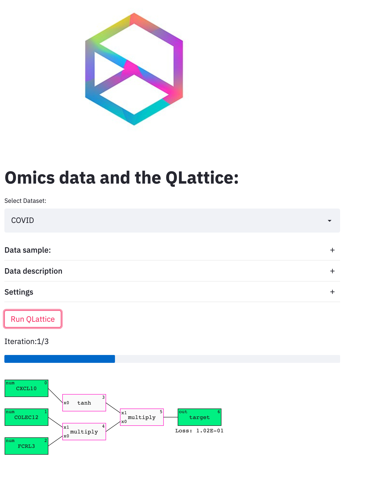

# streamlit_feyn

### A demo tool for the non-technical crowd.

Currently only contains classification examples.

Datasets:
- Alzheimer
- COVID (omics)
- Cancer

#### Install Streamlit
`pip install streamlit`

details: https://docs.streamlit.io/en/stable/installation.html

#### Run the app
`streamlit run omics_demo.py`

#### Screenshot

